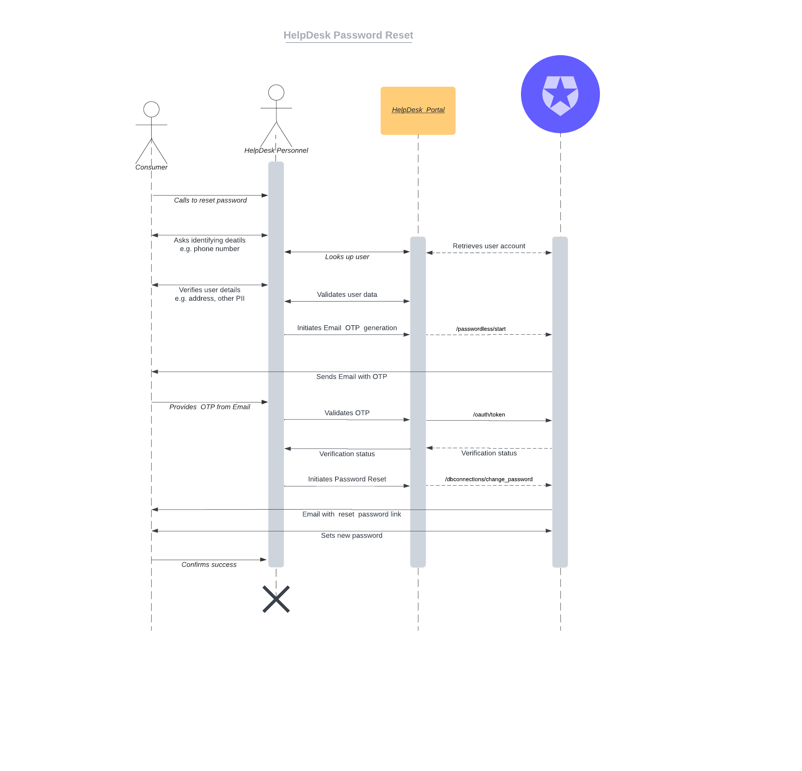

# HelpDesk Password Reset Tool (Auth0)

This app implements a sample HelpDesk Password Reset tool. 

> The app has been tested on private cloud instance. Still needs to be verified on public cloud tenant.



## Setup

* Get a Management API Token manually for testing - [here](https://auth0.com/docs/secure/tokens/access-tokens/get-management-api-access-tokens-for-testing)
* Create a regular web application. Add the **Passwordless OTP** grant type to the application ([here](https://auth0.com/docs/authenticate/passwordless/implement-login/embedded-login/native)).

* Enable **email** Passwordless connection. Add the web application created to the connection.

* Get the name of your Database Connection name. i.e. `consumer-users`.
* Ensure test user profile has the following attributes on the **user_metadata** section -

ie.
```
{
  "telephone": 17735551234,
  "address": "1234 North South Ave"
}
```

*Note*: Telephone number should be numeric, not string

## Sample application

* Create a Glitch account if you already do not have one. 
  
* Remix the following app - https://glitch.com/edit/#!/hdauthotool

* Click on the **.env** file

* Add the following values to the **.env** file -

```
BASE_URL: https://<your auth0 tenant>
CLIENT_ID: <Client ID of the web application>
CLIENT_SECRET: <Client Secret of the web application>
CONNECTION: <Auth0 database Connection the user is in>
API_TOKEN: <management API token>

```

* Access the application through preview


## Gotcha

* Make sure the your Web Application 
